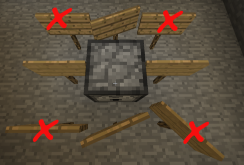

EndlessDispenser is Minecraft Bukkit server plugin that allows users to mark
a dispenser as _endless_ or _infinite_, so that the dispenser never runs out.

Currently, the plugin does *not* support permissions; if you install it,
everyone can create endless dispensers.

# In-game Usage

## Marking a Dispenser as Endless

To mark a dispenser as endless, put a sign on a block that's immediately
adjacent to it and put the phrase `<endless>` on one line of the sign.
(The sign can contain other information, but one line _must_ contain _only_
the phrase `<endless>`.)

"Adjacent", for this plugin, means "directly next to", but does _not_ include
diagonals.

**NOTE:** A sign that's _attached_ to a dispenser will _not_ work. The sign
must be _adjacent_ to the dispenser, not attached to it. (That restriction
allows the plugin to play better with other plugins, such as [Lockette][],
which place special requirements on attaching signs.)

[Lockette]: http://dev.bukkit.org/bukkit-plugins/lockette/

The following diagram shows legal placements. (Note: The diagram does
_not_ show signs directly above and below the dispenser, but those placements,
while uncommon, are also legal.)

If an `<endless>` sign is next to multiple dispensers, it will affect all of
them. Thus, a single sign can be used to make more than one dispenser
endless.

## Dispenser Behavior

An endless dispenser will behave _exactly_ like a regular dispenser, until
there's only one item left in the dispenser's inventory. When the endless
dispenser has dispensed its last item, the EndlessDispenser plugin will
reload the dispenser with a single item of the same type. This behavior has
several implications:

1. You only have to put a single item in the dispenser. It'll dispense and
   reload that item every time it's activated.

2. If you put a single stack of items (say, a stack of 16 eggs) in an
   endless dispenser, it will dispense 15 of them normally, until there's only
   one egg left. After the dispenser dispenses the last egg, EndlessDispenser
   will reload the dispenser with a _single_ egg. When the dispenser dispenses
   _that_ egg, EndlessDispenser will reload it with another egg, and so on.

3. If you load an endless dispenser with multiple stacks of items, the
   dispenser will randomly dispense items from the stacks, just as a regular
   dispenser does. EndlessDispenser kicks in _only_ when there's a single
   item left. So, if you load an endless dispenser with a random assortment
   of objects, which object ends up being endlessly dispensed is essentially
   random, depending entirely on what ends up being the last item in the
   dispenser.

# Getting the Plugin

Currently, the only way to get the plugin is to build it from source. To do
that, you'll need the following:

* A Java JDK (preferably Java 7).
* A recent version of [Gradle](http://gradle.org).

## Building the Plugin

* Check out the repo.
* Run: `gradle zip`
* The resulting distribution is in `build/distributions/mc-endless-dispenser.zip`.

## Installing the Plugin

Unpack the `mc-endless-dispenser.zip` file you built above. Unzipping will
result in an `mc-endless-dispenser` subdirectory containing numerous jar files.
Assuming the top-level directory of your Minecraft world is `$WORLD`, issue the
following commands. (These commands are suitable for Unix and Mac systems. If
you're on Windows, either use the appropriate Windows commands or run the
following commands from a [Cygwin](http://www.cygwin.com/) shell.)

    $ cd mc-endless-dispenser
    $ mkdir -p $WORLD/lib
    $ cp scala-library-2.10.jar $WORLD/lib
    $ cp mclib-0.2.jar $WORLD/lib/mclib.jar
    $ cp scala-library-plugin*.jar scala-plugin-api*.jar EndlessDispenser.jar $WORLD/plugins

Then, restart or reload your Bukkit server.

# Plugin Configuration

The plugin currently doesn't have any configuration.

# Plugin Permissions

The plugin currently doesn't support any permissions. It's either on or off.
Adding permissions is a future enhancement.
